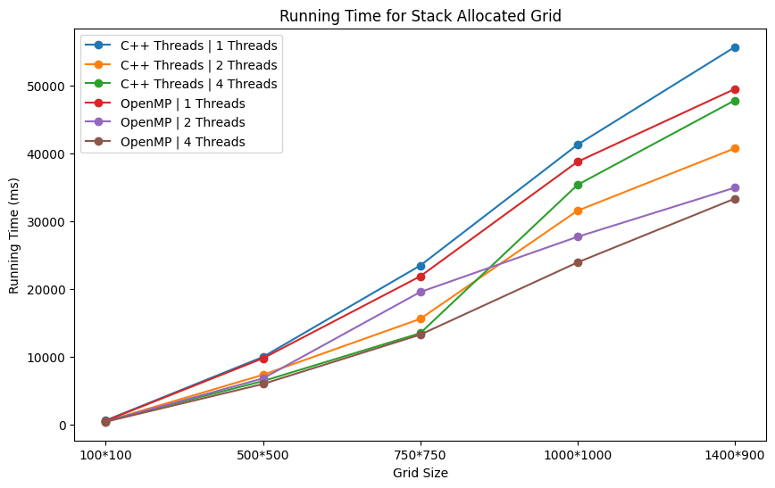
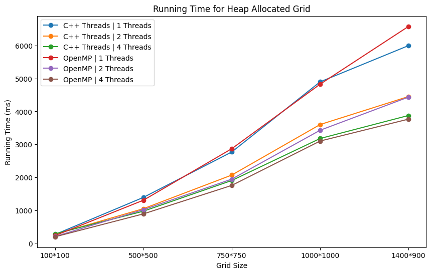
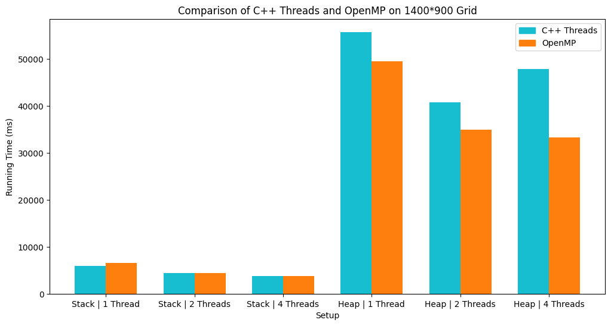

# Conway's Game of Life Parallelised

This is a parallelised implementation of [Conway's Game of Life](https://www.wikiwand.com/en/Conway%27s_Game_of_Life) in C++ with SDL. This is a toy project I did in the middle of 2023 to experiment more with parallel processing and to also become more familiar with C++'s multithreading tools.

# Metrics

All experiments were conducted with a static random seed, the same device, and with a generation time of 100 steps.

# Data

| Setup       | Grid Memory Allocation | Threads | 100\*100 | 500\*500 | 750\*750 | 1000\*1000 | 1400\*900 |
| ----------- | ---------------------- | ------- | -------- | -------- | -------- | ---------- | --------- |
| C++ Threads | Stack                  | 1       | 263      | 1390     | 2769     | 4898       | 5998      |
| C++ Threads | Stack                  | 2       | 268      | 1047     | 2068     | 3602       | 4452      |
| C++ Threads | Stack                  | 4       | 284      | 971      | 1903     | 3178       | 3877      |
| C++ Threads | Heap                   | 1       | 613      | 9974     | 23444    | 41259      | 55657     |
| C++ Threads | Heap                   | 2       | 492      | 7339     | 15586    | 31534      | 40718     |
| C++ Threads | Heap                   | 4       | 528      | 6413     | 13475    | 35341      | 47793     |
| OpenMP      | Stack                  | 1       | 231      | 1304     | 2868     | 4828       | 6581      |
| OpenMP      | Stack                  | 2       | 203      | 1016     | 1945     | 3429       | 4436      |
| OpenMP      | Stack                  | 4       | 194      | 889      | 1754     | 3101       | 3766      |
| OpenMP      | Heap                   | 1       | 559      | 9774     | 21857    | 38746      | 49466     |
| OpenMP      | Heap                   | 2       | 442      | 6809     | 19544    | 27683      | 34924     |
| OpenMP      | Heap                   | 4       | 423      | 5985     | 13255    | 23907      | 33307     |
